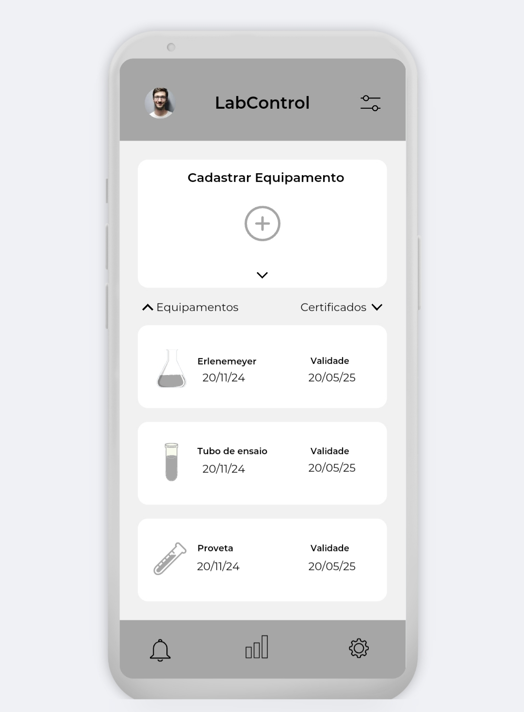
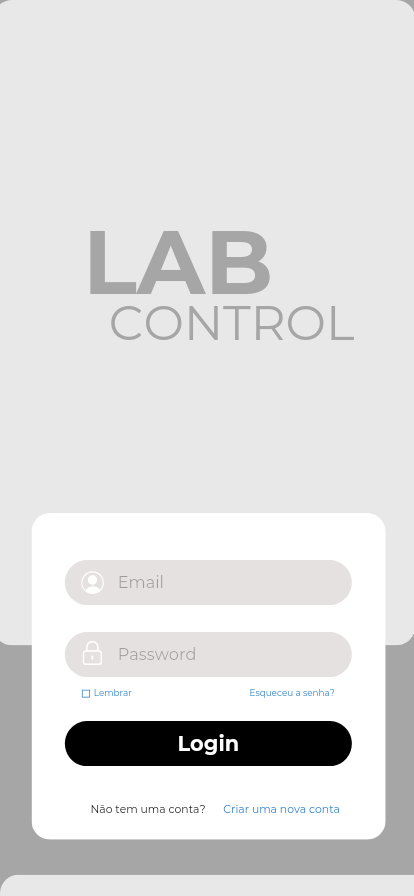
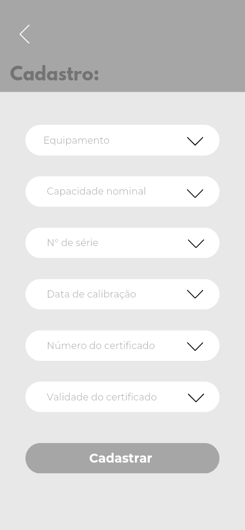

# LabControl

LabControl é um aplicativo desenvolvido em **React Native** para o controle de certificados de calibração de equipamentos de laboratório, focado na simplicidade e objetividade. Ele permite que o usuário registre e acompanhe a validade de calibrações de equipamentos como pipetas e buretas, armazenando os dados localmente no dispositivo.

## Funcionalidades

- **Autenticação de Usuário**: Tela de login com recuperação de senha e criação de nova conta.
- **Cadastro de Equipamentos**: Permite o registro de novos equipamentos com informações detalhadas de calibração.
- **Dashboard**: Exibe uma lista dos últimos equipamentos cadastrados e suas datas de validade.
- **Armazenamento Local**: Todos os dados são armazenados localmente no dispositivo, utilizando SQLite, garantindo que as informações sejam mantidas mesmo offline.
- **Notificações de Validade**: Alerta o usuário sobre certificados próximos do vencimento.

## Tecnologias Utilizadas

- **React Native**: Framework principal para o desenvolvimento do aplicativo mobile.
- **SQLite**: Banco de dados local para armazenamento das informações dos equipamentos e calibrações.
- **React Navigation**: Utilizado para navegação entre as diferentes telas do app.
- **TypeScript**: Superset de JavaScript para maior segurança e produtividade no desenvolvimento.

## Estrutura do Projeto

A estrutura do projeto segue uma organização modular, onde cada funcionalidade está bem separada em pastas:

